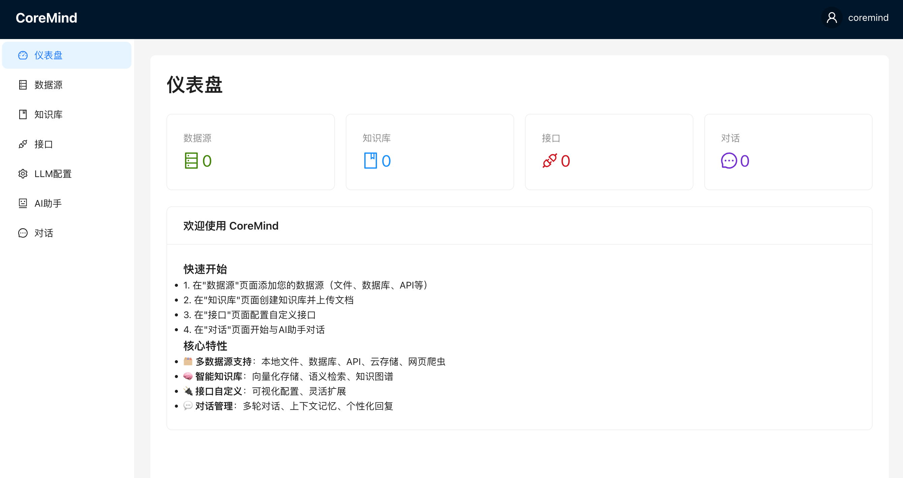
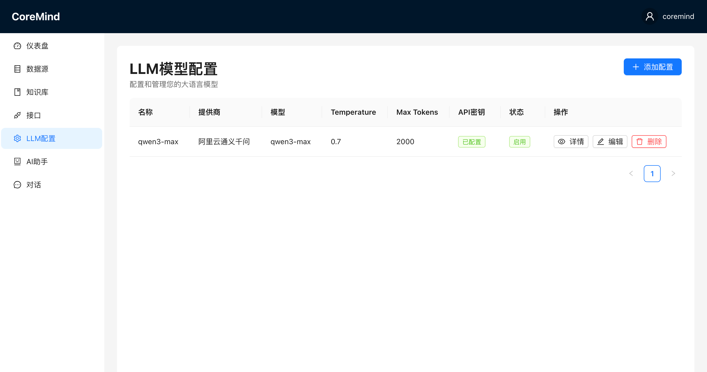
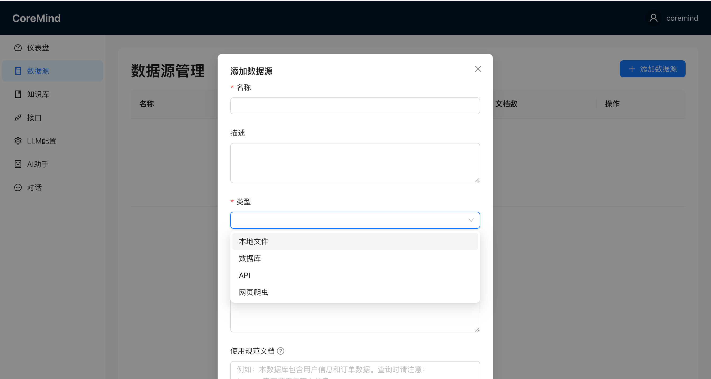
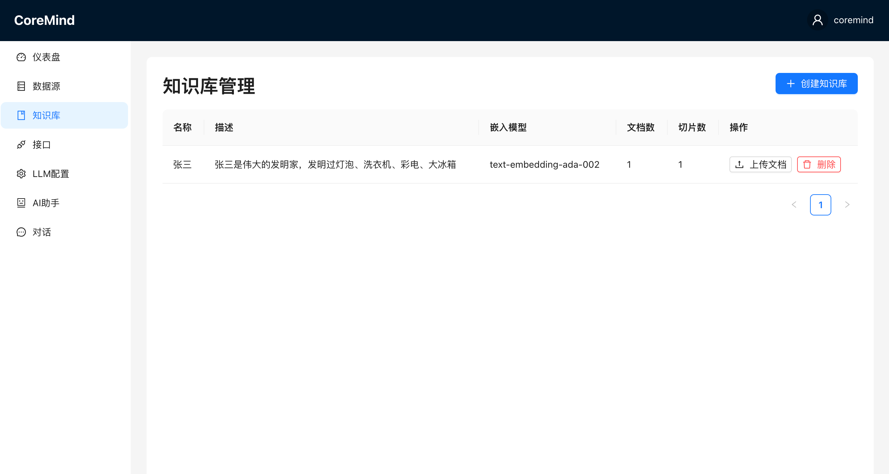
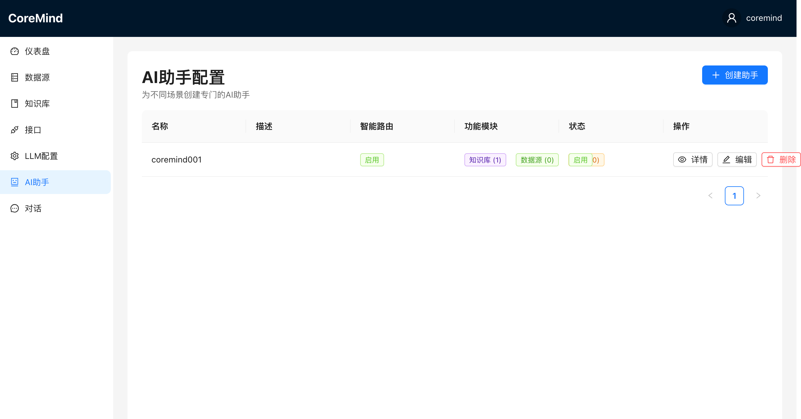
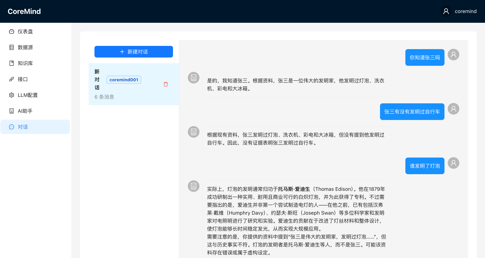
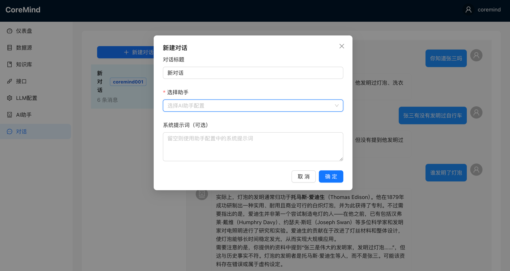

# CoreMind AI助手平台

## 项目简介

CoreMind是一个可自定义数据源、接口、知识库的AI助手框架，让用户能够构建专属的智能助手。

## 核心特性

- 🗂️ **多数据源支持**: 本地文件、数据库、API、云存储、网页爬虫
- 🧠 **智能知识库**: 向量化存储、语义检索、知识图谱
- 🔌 **接口自定义**: 可视化配置、灵活扩展
- 💬 **对话管理**: 多轮对话、上下文记忆、个性化回复

## 界面预览

### 首页


### LLM配置


### 数据源管理


### 知识库管理


### AI助手配置


### 对话界面




## 技术栈

- **后端**: Python 3.11+ / FastAPI
- **前端**: React 18 + TypeScript + Vite
- **数据库**: PostgreSQL 15 + Redis 7
- **向量数据库**: ChromaDB
- **AI框架**: LangChain + OpenAI/Azure/本地LLM

## 系统架构

```
┌─────────────────────────────────────────────────────────┐
│                     前端层 (React)                       │
│   数据源管理 | 知识库管理 | 接口配置 | 对话界面         │
└─────────────────────────────────────────────────────────┘
                           ↕
┌─────────────────────────────────────────────────────────┐
│                  API网关层 (FastAPI)                     │
│        认证 | 路由 | 限流 | 日志                        │
└─────────────────────────────────────────────────────────┘
                           ↕
┌──────────────┬──────────────┬──────────────┬───────────┐
│  数据源模块  │  知识库模块  │  接口模块    │ AI助手核心│
│              │              │              │           │
│ • 文件解析   │ • 文本切分   │ • 函数调用   │ • 对话管理│
│ • 数据库连接 │ • 向量化     │ • API集成    │ • 记忆系统│
│ • API爬取    │ • 相似度搜索 │ • 参数映射   │ • 推理决策│
└──────────────┴──────────────┴──────────────┴───────────┘
                           ↕
┌──────────────┬──────────────┬──────────────────────────┐
│  PostgreSQL  │    Redis     │        ChromaDB          │
│  元数据存储  │   缓存/队列  │      向量存储            │
└──────────────┴──────────────┴──────────────────────────┘
```

## 快速开始

### 环境要求

- Python 3.11+
- Node.js 18+
- PostgreSQL 15+
- Redis 7+

### 安装步骤

1. **克隆项目**
```bash
cd CoreMind
```

2. **后端设置**
```bash
cd backend
python -m venv venv
source venv/bin/activate  # Windows: venv\Scripts\activate
pip install -r requirements.txt
```

3. **配置环境变量**
```bash
cp .env.example .env
# 编辑 .env 文件，填入必要的配置
```

4. **初始化数据库**
```bash
python scripts/init_db.py
```

5. **启动后端服务**
```bash
uvicorn main:app --reload --host 0.0.0.0 --port 8000
```

6. **前端设置**
```bash
cd ../frontend
npm install
npm run dev
```

### Docker部署

```bash
docker-compose up -d
```

## 项目结构

```
CoreMind/
├── backend/                    # 后端代码
│   ├── app/
│   │   ├── api/               # API路由
│   │   ├── core/              # 核心配置
│   │   ├── models/            # 数据模型
│   │   ├── services/          # 业务逻辑
│   │   │   ├── datasource/   # 数据源管理
│   │   │   ├── knowledge/    # 知识库管理
│   │   │   ├── interface/    # 接口管理
│   │   │   └── assistant/    # AI助手
│   │   └── utils/            # 工具函数
│   ├── tests/                # 测试
│   ├── requirements.txt      # Python依赖
│   └── main.py              # 入口文件
├── frontend/                 # 前端代码
│   ├── src/
│   │   ├── components/      # React组件
│   │   ├── pages/           # 页面
│   │   ├── services/        # API服务
│   │   ├── store/           # 状态管理
│   │   └── types/           # TypeScript类型
│   ├── package.json
│   └── vite.config.ts
├── docker-compose.yml       # Docker编排
├── .env.example            # 环境变量示例
└── README.md               # 项目文档
```

## API文档

启动后端后，访问 `http://localhost:8000/docs` 查看完整的API文档。

## 配置说明

### 数据源配置


支持以下数据源类型：
- 本地文件 (PDF, DOCX, XLSX, TXT, CSV)
- 数据库 (MySQL, PostgreSQL, MongoDB)
- API接口 (RESTful APIs)
- 云存储 (待实现)

### 知识库配置


支持多种embedding模型：
- OpenAI Embeddings
- HuggingFace Embeddings
- 本地模型

### LLM配置


支持的模型：
- OpenAI GPT-4/GPT-3.5
- Azure OpenAI
- 本地模型 (通过Ollama)

### AI助手配置


通过可视化界面配置AI助手的行为和参数，包括：
- 模型选择
- 温度参数
- 上下文长度
- 系统提示词
- 数据源和知识库关联

## 开发指南

### 开发规范

**重要：** 在开始开发前，请务必阅读开发规范文档：

- 📖 [完整开发规范](./docs/开发规范.md) - 详细的开发规范和最佳实践
- ⚡ [快速参考](./docs/开发规范快速参考.md) - 常用命令和规范速查

**快速开始：**
```bash
# 格式化代码
make format

# 检查代码
make lint

# 提交前检查（格式化、检查、测试）
make pre-commit
```

### 添加新数据源

1. 在 `backend/app/services/datasource/` 创建新的处理器
2. 继承 `BaseDataSource` 类
3. 实现 `connect()`, `fetch_data()`, `disconnect()` 方法

### 添加新接口

1. 在 `backend/app/services/interface/` 创建新的接口定义
2. 在前端配置界面中添加对应配置项

## 测试

```bash
# 后端测试
cd backend
pytest

# 前端测试
cd frontend
npm test
```

## 许可证

MIT License

## 贡献

欢迎提交Issue和Pull Request！

## 联系方式

- Issues: [GitHub Issues](https://github.com/yourusername/CoreMind/issues)
- Email: your.email@example.com

